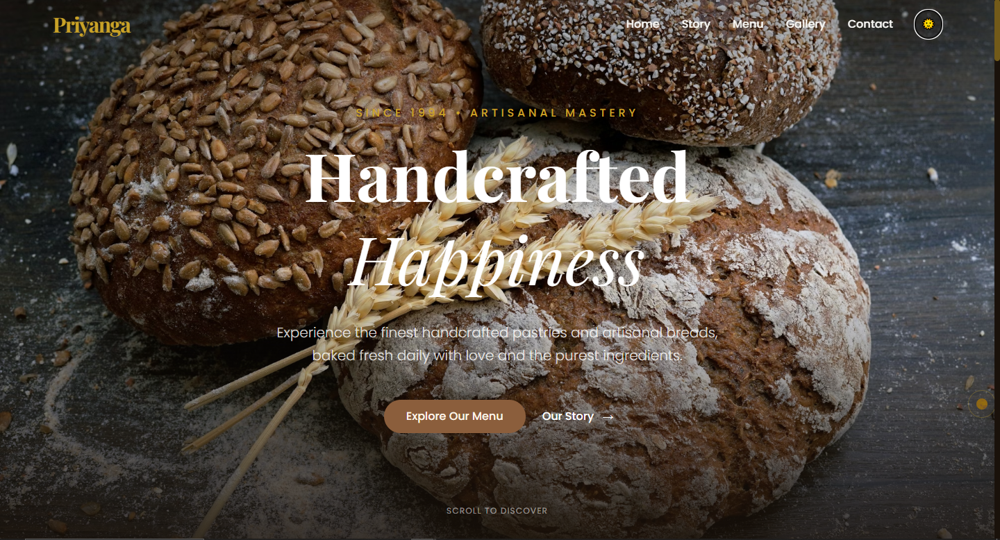

# 🥖 Priyanga — Handcrafted Luxury Bakery

[](https://reactjs.org/)
[](https://tailwindcss.com/)
[](https://www.framer.com/motion/)
[](https://vitejs.dev/)

Priyanga is an ultra-premium, cinematic, and mobile-responsive luxury bakery website. Designed with a minimal luxury aesthetic, it features rich animations, immersive scroll effects, and a storytelling layout that brings the artisanal baking experience to life.

---

## 🌐 Live Preview
🔗 **Website:**  
https://premium-bakery.vercel.app/ 


# 📸 Website Preview

## 🖥️ Screenshot


---

# ✨ About The Project
**Priyanga Premium Bakery Website** is a modern, animated, and luxury-style local bakery website built to attract customers, showcase bakery products beautifully, and provide easy access to shop location, menu, and contact details.

This website is designed with:
- Premium UI/UX
- Smooth scroll animations
- Local business focus
- Elegant product presentation
- Mobile-first responsive layout

Perfect for:
- Local Bakeries
- Cafés
- Food Brands
- Small Businesses
- Premium Shop Websites

---

# 🎨 Design Highlights
- Minimal Luxury Design
- Warm Bakery Color Palette
- Cinematic Scroll Experience
- Elegant Typography
- Modern Glassmorphism Effects
- Smooth Micro-Interactions

---


## ✨ Features

### 🎬 Cinematic UI/UX
- **Smooth Scroll Animations**: Sections gracefully reveal themselves as you navigate.
- **Ken Burns Hero**: A high-end background animation for a premium first impression.
- **Custom Particles**: Subtle golden ambient particles representing "flour dust" or light.
- **Interactive Cursor**: A spring-animated custom cursor that reacts to hover states.

### 🥐 Artisanal Content
- **Signature Showcase**: Filterable menu with smooth layout transitions for cakes, breads, and pastries.
- **Aesthetic Gallery**: High-quality masonry grid with a custom lightbox experience.
- **Experience Section**: Beautifully animated icons highlighting craftsmanship and quality.

### 🛠 Technical Excellence
- **Vite + React**: Lightning-fast performance and modern build tools.
- **Tailwind CSS v4**: Utility-first styling with a custom luxury theme configuration.
- **Framer Motion**: State-of-the-art web animations and layout morphing.
- **Dual Themes**: Elegant Light and Luxury Dark mode support.

## 🍩 Business-Focused Sections
- Hero Section (Cinematic Banner)
- About Bakery (Story Section)
- Product Showcase (Menu)
- Gallery Section
- Testimonials
- Contact & Location (Google Map)
- WhatsApp & Call Integration

## 📱 Fully Responsive
- Mobile-first design
- Tablet optimized
- Desktop premium layout
- Cross-browser support

## 📍 Local Business Optimization
- Click-to-call button
- WhatsApp order button
- Shop location & opening hours
- SEO-friendly structure
- Customer-friendly navigation

---

## 🎨 Design System

| Element | Palette / Detail |
| :--- | :--- |
| **Typography** | Playfair Display (Serif), Poppins (Sans) |
| **Cream** | `#FFF6E9` (Background) |
| **Gold** | `#C9A227` (Accents) |
| **Soft Brown** | `#8B5E3C` (Text/Details) |
| **Glassmorphism** | Blur-heavy cards and navigation |

---

## 🚀 Getting Started

### Prerequisites
- [Node.js](https://nodejs.org/) (v18 or higher recommended)
- [npm](https://www.npmjs.com/)

### Installation

1. **Clone the repository** (or navigate to the project folder):
   ```bash
   cd PremiumBakery
   ```

2. **Install dependencies**:
   ```bash
   npm install
   ```

3. **Start the development server**:
   ```bash
   npm run dev
   ```

4. **Build for production**:
   ```bash
   npm run build
   ```

---

## 📁 Project Structure

```text
src/
├── components/      # Reusable UI components (Navbar, Cursor, ParticleBackground)
├── sections/        # Homepage sections (Hero, BrandStory, Gallery, etc.)
├── App.jsx          # Main application shell and theme management
├── index.css        # Tailwind v4 configuration and global styles
└── main.jsx         # Entry point
```

---

# 📊 Performance & SEO
- ⚡ Optimized Vite build for fast loading
- 📱 Fully mobile responsive (Core Web Vitals friendly)
- 🧠 Semantic HTML structure
- 🔍 SEO-friendly layout for local bakery keywords
- 🚀 Optimized animations with hardware acceleration


---

# 👨‍💻 Developer

 **Navaneeth K V** <br>
 *Frontend & Full Stack Developer* <br>
  📍 India
 - GitHub: https://github.com/Navaneeth223
 - LinkedIn: https://www.linkedin.com/in/navaneeth-kv-270386214/

---

# 🏆 Portfolio Value

### This project demonstrates:
- Advanced UI/UX design skills
- Production-level animation implementation
- Luxury brand design thinking
- Real-world business website architecture
- Modern React + Tailwind expertise <br>
### **Ideal for:**
- Recruiter showcase
- Client portfolio
- Premium frontend case study

---

## 📜 License

Created by **Navaneeth K V** for Priyanga Luxury Bakery. This project is for showcase purposes.

> "Handcrafted Happiness, Baked with Love."
